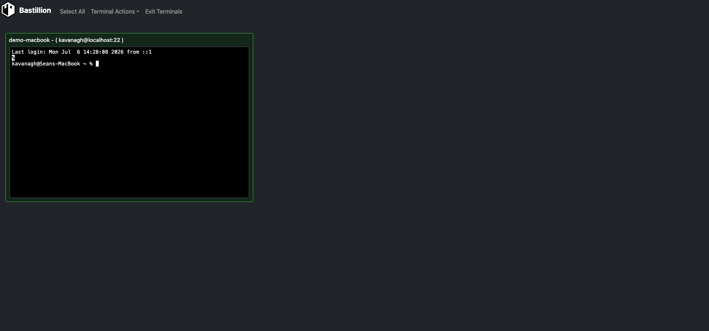
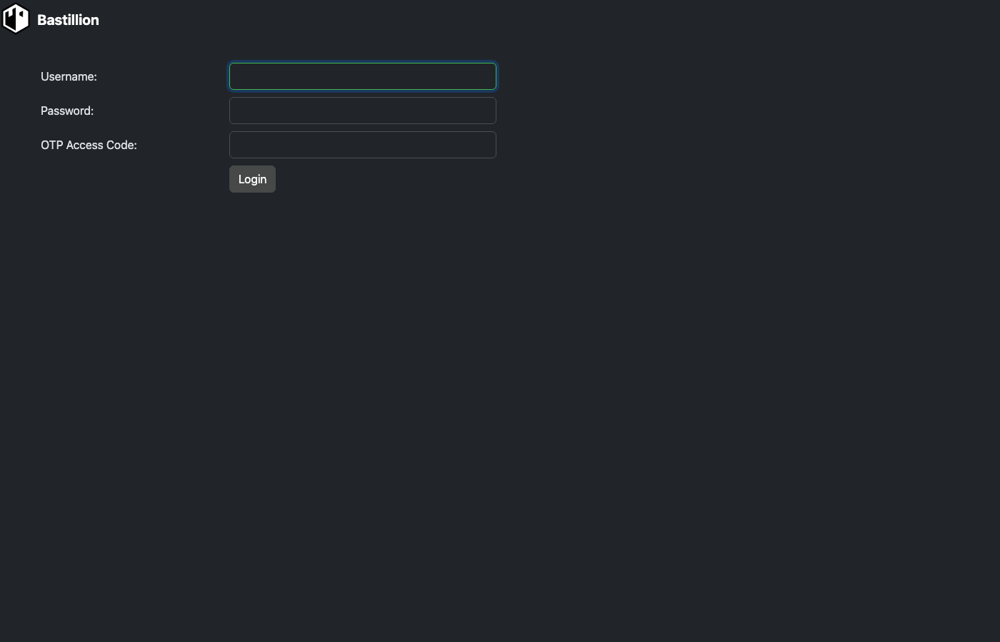
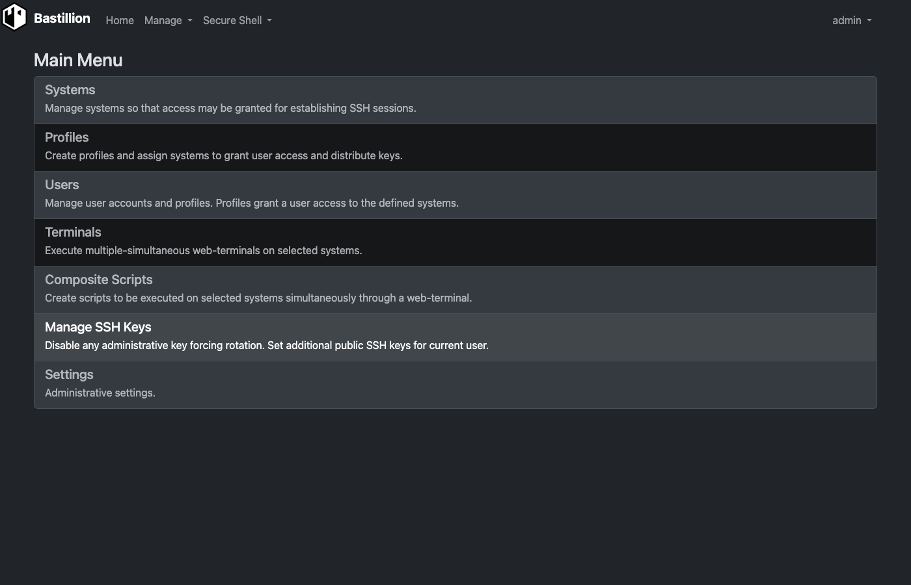
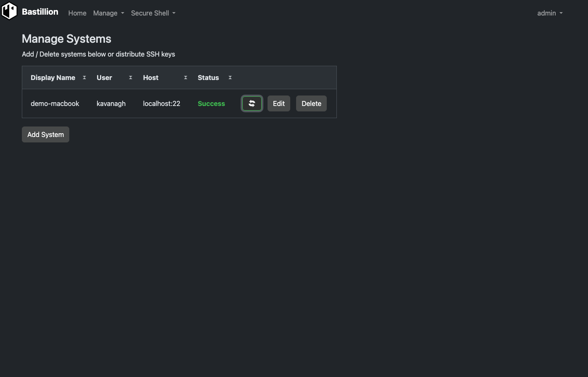
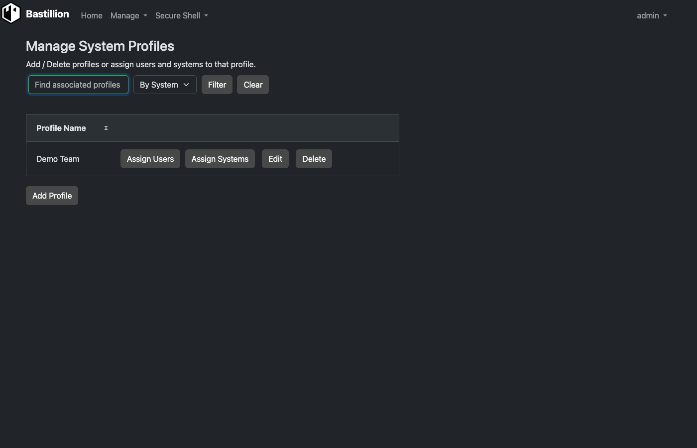
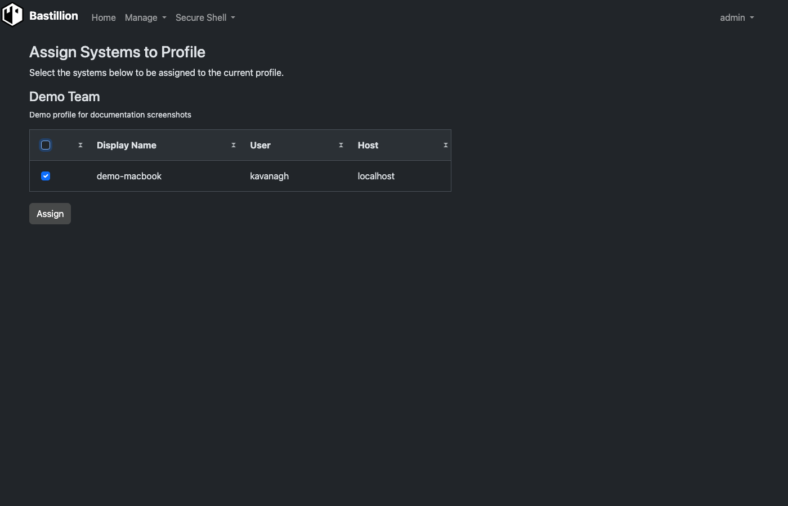
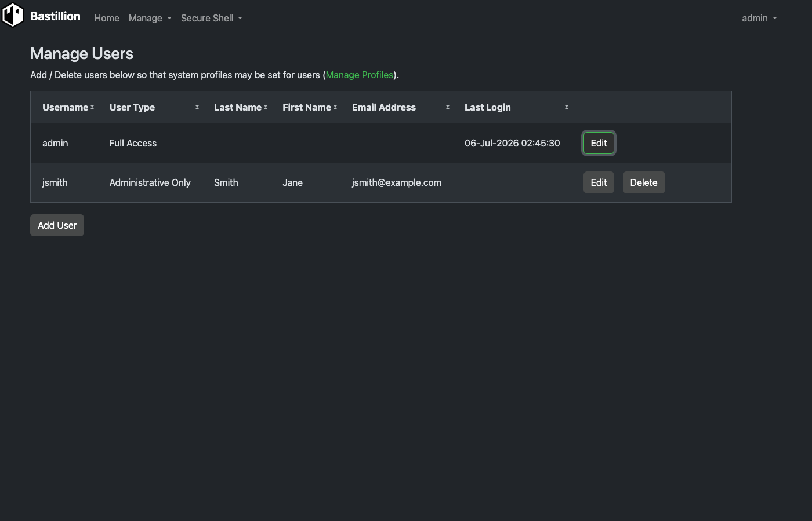
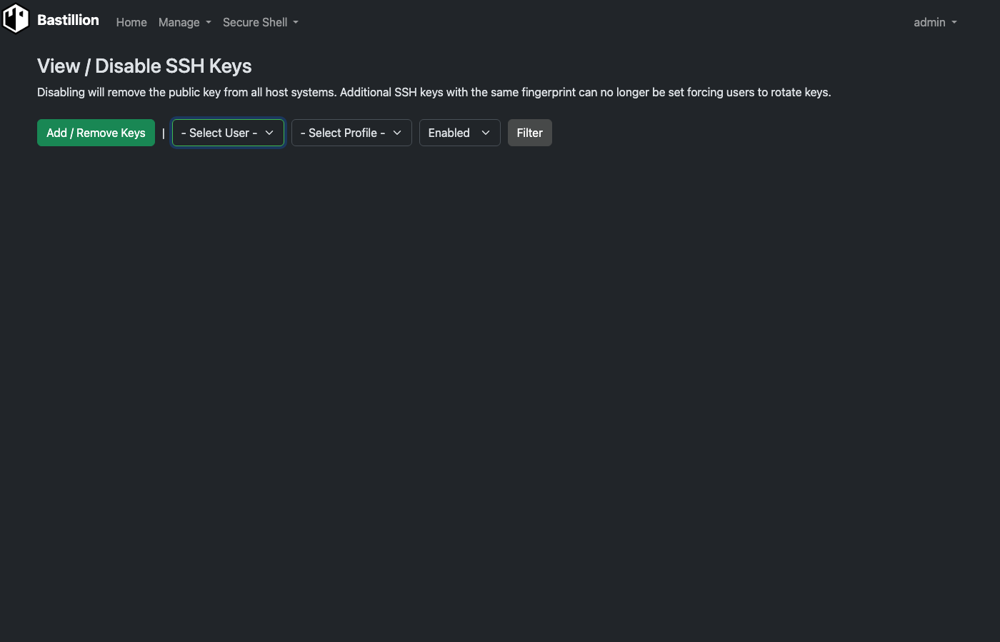
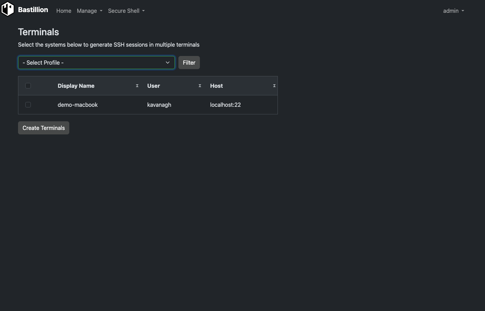
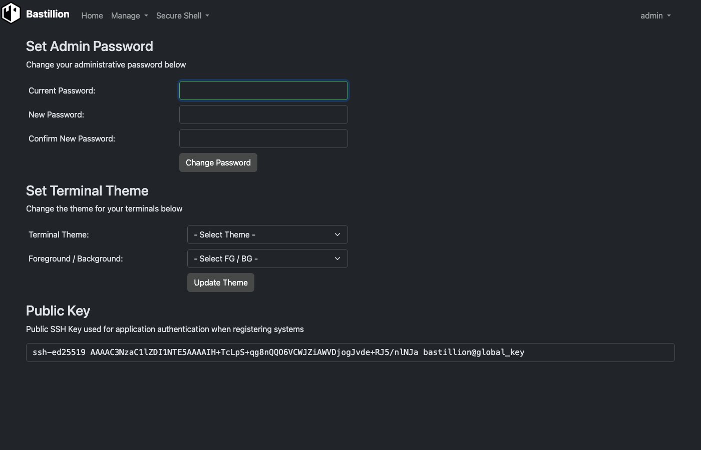

# Bastillion

**A modern, web-based SSH console and SSH key management tool.**

Bastillion gives you a clean, browser-based way to manage SSH access across all your systems—like a bastion host with a friendly dashboard. It does two things:

1. **SSH key management** — Bastillion holds its own SSH keypair and pushes/rotates public keys across the hosts you register, so individual users never need to hold or manage long-lived keys to those systems themselves.
2. **Web-based SSH terminal** — once a host is registered, authorized users can open one or more live terminal sessions to it directly from the browser, with commands optionally broadcast across every open session at once.

You can:
- Log in with **2-factor authentication** (Authy or Google Authenticator)
- Manage and distribute **SSH public keys**, and disable/rotate them centrally
- Launch secure multi-session web shells and **share commands** across sessions
- Stack **TLS/SSL over SSH** for extra protection



---

## How It Works

Bastillion sits between your users and the systems they need to reach, acting as a trusted third party rather than a simple password vault:

1. **Bastillion generates its own SSH keypair** on first startup (see the console output, or `Settings` in the UI).
2. An **admin registers a host system** (user, host, port, and the path to that host's `authorized_keys` file) under **Manage → Systems**.
3. Bastillion authenticates to the host **once** with a password or passphrase you supply, then **pushes its own public key** into that host's `authorized_keys`. From then on it connects using that key — no stored passwords.
4. Admins group systems into **Profiles**, then assign **Users** to those profiles under **Manage → Profiles**, controlling exactly who can reach which hosts.
5. Assigned users open **Secure Shell → Terminals**, pick one or more systems, and get live, resizable, xterm-based terminals in the browser — with the option to broadcast the same keystrokes to every open terminal at once, or run a saved **Composite Script** across all of them.
6. Keys can be centrally **disabled or rotated** at any time under **Manage SSH Keys**, immediately revoking access without touching the target systems by hand.

---

## 🚀 What’s New
- Upgraded to **Java 21** and **Jakarta EE 11**
- Full support for **Ed25519** (default) and **Ed448** SSH keys
- New **daemon mode** for Jetty startup (`--daemon`)
- Updated dependencies for improved security and performance


---
## Installation Options
**Free:** https://github.com/bastillion-io/Bastillion/releases  
**AWS Marketplace:** https://aws.amazon.com/marketplace/pp/prodview-x2imjupuydrj6

---

## Prerequisites

### Java 21 (OpenJDK or Oracle JDK)
```bash
apt-get install openjdk-21-jdk
```
> Oracle JDK download: http://www.oracle.com/technetwork/java/javase/downloads/index.html

### Authenticator (for 2FA)

| Application | Android | iOS |
|--------------|----------|-----|
| **Authy** | [Google Play](https://play.google.com/store/apps/details?id=com.authy.authy) | [iTunes](https://itunes.apple.com/us/app/authy/id494168017) |
| **Google Authenticator** | [Google Play](https://play.google.com/store/apps/details?id=com.google.android.apps.authenticator2) | [iTunes](https://itunes.apple.com/us/app/google-authenticator/id388497605) |

---

## Run with Jetty (Bundled)

Download: https://github.com/bastillion-io/Bastillion/releases

### Set Environment Variables
**Linux / macOS**
```bash
export JAVA_HOME=/path/to/jdk
export PATH=$JAVA_HOME/bin:$PATH
```
**Windows**
```cmd
set JAVA_HOME=C:\path\to\jdk
set PATH=%JAVA_HOME%\bin;%PATH%
```

### Start Bastillion
Foreground (interactive):
```bash
./startBastillion.sh
```

Daemon (background):
```bash
./startBastillion.sh --daemon
```
Logs are stored in `jetty/logs/YYYY_MM_DD.jetty.log`.

Enable debug output:
```bash
./startBastillion.sh -d
```

Stop:
```bash
./stopBastillion.sh
```

Access in browser:  
`https://<server-ip>:8443` (or for AMI instances: `https://<instance-ip>:443`)

Default credentials:
```
username: admin
password: changeme
```

---

## Build from Source

Install Maven 3+:
```bash
apt-get install maven
```

Build and run:
```bash
mvn package jetty:run
```

> ⚠️ `mvn clean` will remove the H2 database and user data.

---

## SSH Key Management

Settings live in `BastillionConfig.properties`:

```properties
# Disable key management (append instead of overwrite)
keyManagementEnabled=false

# authorized_keys refresh interval in minutes (no refresh for <=0)
authKeysRefreshInterval=120

# Force user key generation and strong passphrases
forceUserKeyGeneration=false
```

---

## Custom SSH Key Pair

Specify a custom SSH key pair or let Bastillion generate its own on startup:

```properties
# Regenerate and import SSH keys
resetApplicationSSHKey=true

# SSH key type ('rsa', 'ecdsa', 'ed25519', or 'ed448')
# Supported options:
#   rsa    - Classic, widely compatible (configurable length, default 4096)
#   ecdsa  - Faster, smaller keys (P-256/384/521 curves)
#   ed25519 - Default and recommended (≈ RSA-4096, secure and fast)
#   ed448  - Extra-strong (≈ RSA-8192, slower and less supported)
sshKeyType=ed25519

# Private key
privateKey=/Users/you/.ssh/id_rsa

# Public key
publicKey=/Users/you/.ssh/id_rsa.pub

# Passphrase (leave blank if none)
defaultSSHPassphrase=myPa$$w0rd
```

Once registered, you can remove the key files and passphrase from the configuration.

---

## Database Settings

Embedded H2 example:
```properties
dbUser=bastillion
dbPassword=p@$$w0rd!!
dbDriver=org.h2.Driver
dbConnectionURL=jdbc:h2:keydb/bastillion;CIPHER=AES;
```

Remote H2 example:
```properties
dbConnectionURL=jdbc:h2:tcp://<host>:<port>/~/bastillion;CIPHER=AES;
```

---

## External Authentication (LDAP)

Enable external auth in `BastillionConfig.properties`:
```properties
jaasModule=ldap-ol
```

Configure `jaas.conf`:
```
ldap-ol {
    com.sun.security.auth.module.LdapLoginModule SUFFICIENT
    userProvider="ldap://hostname:389/ou=example,dc=bastillion,dc=com"
    userFilter="(&(uid={USERNAME})(objectClass=inetOrgPerson))"
    authzIdentity="{cn}"
    useSSL=false
    debug=false;
};
```

To map LDAP roles to Bastillion profiles:
```
ldap-ol-with-roles {
    org.eclipse.jetty.jaas.spi.LdapLoginModule required
    debug="false"
    useLdaps="false"
    contextFactory="com.sun.jndi.ldap.LdapCtxFactory"
    hostname="<SERVER>"
    port="389"
    bindDn="<BIND-DN>"
    bindPassword="<BIND-DN PASSWORD>"
    authenticationMethod="simple"
    forceBindingLogin="true"
    userBaseDn="ou=users,dc=bastillion,dc=com"
    userRdnAttribute="uid"
    userIdAttribute="uid"
    userPasswordAttribute="userPassword"
    userObjectClass="inetOrgPerson"
    roleBaseDn="ou=groups,dc=bastillion,dc=com"
    roleNameAttribute="cn"
    roleMemberAttribute="member"
    roleObjectClass="groupOfNames";
};
```

Admins are added upon first login and can be assigned system profiles.  
Users are synced with profiles when their LDAP role names match Bastillion profiles.

---

## Auditing

Auditing is disabled by default.

Enable it in **log4j2.xml** by uncommenting:
- `io.bastillion.manage.util.SystemAudit`
- `audit-appender`

> https://github.com/bastillion-io/Bastillion/blob/master/src/main/resources/log4j2.xml#L19-L22

Also enable in `BastillionConfig.properties`:
```properties
enableInternalAudit=true
```

---

## Screenshots

### Login & Access

**Login** — username/password, with an optional OTP access code field for 2FA.



**Two-Factor Setup** — scan the QR code with Authy or Google Authenticator to enable 2FA for an account.


**Main Menu** — the landing page after login, linking to system/profile/user management, terminals, scripts, and key management, scoped to what the logged-in user is allowed to see.



### SSH Key Management

**Manage Systems** — register a host (user, host, port, `authorized_keys` path). Bastillion authenticates once with a password/passphrase you provide, then pushes its own public key to the host — status flips to **Success** once the key is in place and subsequent connections are key-based only.



**Manage Profiles** — group systems into named profiles that control access.



**Assign Systems to a Profile** — pick which registered hosts belong to a profile.



**Manage Users** — create accounts and assign them a user type; users are then linked to profiles to grant them access to specific systems.



**View / Disable SSH Keys** — see every key in use across systems and users, and disable/rotate a key everywhere at once, forcing re-registration.



### Web-Based SSH Terminal

**Terminals** — pick one or more systems (optionally filtered by profile) to open simultaneously.



**Web Terminal** — a live, resizable xterm-based session per host; keystrokes can be broadcast to every open terminal at once for running the same command across multiple systems.


**Composite Scripts** — save a script once and execute it across every selected terminal session.


**User Settings** — change your password, customize the terminal color theme, and view the public key Bastillion uses to authenticate to registered systems.



---

## Thanks to

- [JSch](http://www.jcraft.com/jsch)
- [term.js](https://github.com/chjj/term.js)

See full dependencies in [_3rdPartyLicenses.md_](3rdPartyLicenses.md).

---

## License

Bastillion is available under the **Prosperity Public License**.

---

## Author

**Loophole, LLC — Sean Kavanagh**  
Email: [sean.p.kavanagh6@gmail.com](mailto:sean.p.kavanagh6@gmail.com)  
Instagram: [@spkavanagh6](https://www.instagram.com/spkavanagh6/)
