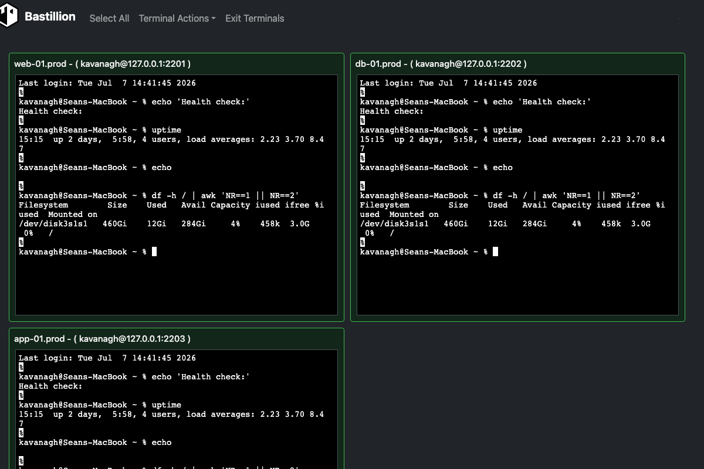

<p align="center">
  
</p>

<h1 align="center">Bastillion</h1>
<p align="center"><strong>A modern, web-based SSH console and SSH key management tool.</strong></p>

Bastillion gives you a clean, browser-based way to manage SSH access across all your
systems — like a bastion host with a friendly dashboard. It does two things:

1. **SSH key management** — Bastillion holds its own SSH keypair and pushes/rotates public
   keys across the hosts you register, so individual users never need to hold or manage
   long-lived keys to those systems themselves.
2. **Web-based SSH terminal** — once a host is registered, authorized users can open one or
   more live terminal sessions to it directly from the browser, with commands optionally
   broadcast across every open session at once (think tmux's synchronized panes, but for a
   fleet of remote hosts instead of local panes).

- Log in with **2-factor authentication** (Authy or Google Authenticator)
- Manage and distribute **SSH public keys**, and disable/rotate them centrally
- Launch secure multi-session web shells and **share commands** across sessions
- Group systems into **Profiles** and control exactly who can reach what
- Save and re-run **Composite Scripts** across a whole fleet at once
- Stack **TLS/SSL over SSH** for extra protection


<p align="center"><sub>Three real, independent SSH sessions — one command, typed once, run everywhere.</sub></p>

---

## Contents

- [How It Works](#how-it-works)
- [What's New](#-whats-new)
- [Licensing](#licensing)
- [Installation Options](#installation-options)
- [Prerequisites](#prerequisites)
- [Download and Run](#download-and-run)
- [Build from Source](#build-from-source)
- [TLS / HTTPS](#tls--https)
- [Configuration](#configuration)
- [More Screenshots](#more-screenshots)
- [License](#license)

---

## How It Works

Bastillion sits between your users and the systems they need to reach, acting as a trusted
third party rather than a simple password vault. Here's the whole lifecycle, end to end.

### 1. Bastillion generates its own SSH keypair

On first startup, before anything else, Bastillion generates an Ed25519 keypair for
itself — this is the *one* key that ever gets pushed to your hosts. It's shown in the
console output and always visible under **Settings**.

### 2. Register a system

An admin adds a host under **Manage → Systems** (user, host, port, and the path to that
host's `authorized_keys` file). Bastillion authenticates **once** with a password or
passphrase you supply, then pushes its own public key into that host's `authorized_keys`.
From then on it connects using that key — no stored passwords, ever. Status flips to
**Success** the moment the key is in place.


### 3. Group systems into Profiles, assign Users

Systems get grouped into named **Profiles** — think "Production," "Staging," "Database
Tier." Users are then linked to profiles under **Manage → Users**, which is the only thing
that controls who can reach what. Revoke a profile assignment and that access is gone
immediately, no key rotation needed.


### 4. Open terminals — and broadcast to all of them at once

Assigned users open **Secure Shell → Terminals**, pick one or more systems, and get live,
resizable, xterm-based terminals in the browser, side by side. Type once, and it goes to
every terminal marked active — the same keystroke, the same command, the same output shape,
across as many hosts as you selected.


### 5. Save it as a Composite Script

Anything you'd type interactively can be saved as a **Composite Script** and re-run later
across a whole fleet with one click — no more pasting the same five commands into five
terminals by hand.



### 6. Rotate or revoke keys centrally

Because every host trusts the *same* application key (not one key per user), disabling it
once under **Manage SSH Keys** revokes access everywhere immediately — no need to touch
target systems by hand, no hunting down which server has which stale key.


---

## 🚀 What's New
- **Licensing** — free at up to 3 systems, paid tiers available at [loophole.company/pricing.html](https://loophole.company/pricing.html) (see [Licensing](#licensing) below)
- Runs as a **self-contained jar** (`java -jar`) with HTTPS out of the box — see [Download and Run](#download-and-run)
- Upgraded to **Java 21** and **Jakarta EE 11**
- Full support for **Ed25519** (default) and **Ed448** SSH keys
- Updated dependencies for improved security and performance

---

## Licensing

Bastillion runs unlicensed at up to **3 registered systems** — enough to try it for real
before buying. A license raises that cap.

1. Buy a license at **[loophole.company/pricing.html](https://loophole.company/pricing.html)**
   (Starter/Team/Business — priced by system count). Payment redirects back and downloads a
   `.lic` file automatically.
2. Open the `.lic` file and copy its contents (one line).
3. Set it via the `LICENSE_KEY` environment variable:
   ```bash
   export LICENSE_KEY=<paste license file contents here>
   ```
   or paste it into `licenseKey` in `BastillionConfig.properties` instead — the environment
   variable takes precedence if both are set.
4. Restart Bastillion. **Settings** shows the licensee, system cap, and expiry, with a
   warning starting 90 days before it expires.

Licenses are annual and don't auto-renew — no card kept on file. Buy again from the same
pricing page when you get the expiry warning.

---

## Installation Options
**Free:** https://github.com/bastillion-io/Bastillion/releases

---

## Prerequisites

### Java 21 (OpenJDK or Oracle JDK)
```bash
apt-get install openjdk-21-jdk
```
> Oracle JDK download: http://www.oracle.com/technetwork/java/javase/downloads/index.html

### Authenticator (for 2FA)

| Application | Android | iOS |
|--------------|----------|-----|
| **Authy** | [Google Play](https://play.google.com/store/apps/details?id=com.authy.authy) | [iTunes](https://itunes.apple.com/us/app/authy/id494168017) |
| **Google Authenticator** | [Google Play](https://play.google.com/store/apps/details?id=com.google.android.apps.authenticator2) | [iTunes](https://itunes.apple.com/us/app/google-authenticator/id388497605) |

---

## Download and Run

Download the latest jar from [Releases](https://github.com/bastillion-io/Bastillion/releases):
```bash
java -jar bastillion-<version>.jar
```

Access in browser: `https://<server-ip>:8443` — see [TLS / HTTPS](#tls--https) below for the
self-signed certificate Bastillion generates on first run.

Default credentials:
```
username: admin
password: changeme
```

Runs in the foreground; stop with Ctrl+C. For background/daemon operation use whatever your
platform normally uses for a long-running Java process — `nohup java -jar ... &`, a systemd
unit, a container, etc.

---

## Build from Source

Install Maven 3+:
```bash
apt-get install maven
```

Build and run (packages a self-contained jar with an embedded Jetty server — see
`io.bastillion.Main` — and runs it):
```bash
mvn package
java -jar target/bastillion-5.0.0-SNAPSHOT.jar
```

Or for local dev without repackaging on every change:
```bash
mvn compile exec:java
```

Listens on `https://localhost:8443` by default, same as the downloaded release above — see
[TLS / HTTPS](#tls--https) below for how that certificate gets set up and how to use your
own instead.

> ⚠️ `mvn clean` will remove the H2 database and user data.

---

## TLS / HTTPS

Bastillion generates its own self-signed certificate on first startup and serves HTTPS —
nothing to configure. Browsers will show a warning once (it's self-signed, not issued by a
CA); click through it, same as you would for any other self-hosted appliance. The
certificate and its password persist across restarts (`keystore/bastillion.p12` next to
where you run it, password stored the same encrypted way as the database password).

**Use your own certificate** (e.g. one from Let's Encrypt/certbot) by converting it to
PKCS12 and pointing Bastillion at it:
```bash
openssl pkcs12 -export -in fullchain.pem -inkey privkey.pem \
  -out bastillion.p12 -name bastillion -passout pass:changeit

export KEYSTORE_PATH=/path/to/bastillion.p12
export KEYSTORE_PASSWORD=changeit
```

**Behind a reverse proxy or load balancer that already terminates TLS** (nginx, Cloud
Run, etc.) — disable Bastillion's own HTTPS and let it serve plain HTTP instead:
```bash
export TLS_ENABLED=false
```
Defaults to port 8080 in this mode; set `PORT` to change it.

---

## Configuration

Every setting below can be set as an **environment variable** — take the property name and
insert an underscore before each capital letter, then uppercase it: `licenseKey` →
`LICENSE_KEY`, `dbUser` → `DB_USER`, `sshKeyType` → `SSH_KEY_TYPE`. This is the recommended
way to configure Bastillion, especially in containers — no file to mount or bake in.

`BastillionConfig.properties` still works as a fallback (env vars always win if both are
set), and is where any value Bastillion generates for you at first startup — like a random
DB password — gets persisted. See `src/main/resources/BastillionConfig.properties` for the
full list of settings and their defaults.

<details>
<summary><strong>SSH Key Management</strong></summary>

```bash
# Disable key management (append instead of overwrite)
export KEY_MANAGEMENT_ENABLED=false

# authorized_keys refresh interval in minutes (no refresh for <=0)
export AUTH_KEYS_REFRESH_INTERVAL=120

# Force user key generation and strong passphrases
export FORCE_USER_KEY_GENERATION=false
```
</details>

<details>
<summary><strong>Custom SSH Key Pair</strong></summary>

Specify a custom SSH key pair or let Bastillion generate its own on startup:

```bash
# Regenerate and import SSH keys
export RESET_APPLICATION_SSH_KEY=true

# SSH key type ('rsa', 'ecdsa', 'ed25519', or 'ed448')
# Supported options:
#   rsa    - Classic, widely compatible (configurable length, default 4096)
#   ecdsa  - Faster, smaller keys (P-256/384/521 curves)
#   ed25519 - Default and recommended (≈ RSA-4096, secure and fast)
#   ed448  - Extra-strong (≈ RSA-8192, slower and less supported)
export SSH_KEY_TYPE=ed25519

# Private key
export PRIVATE_KEY=/Users/you/.ssh/id_rsa

# Public key
export PUBLIC_KEY=/Users/you/.ssh/id_rsa.pub

# Passphrase (leave blank if none)
export DEFAULT_SSH_PASSPHRASE=myPa$$w0rd
```

Once registered, you can drop these — the key pair is already stored in the database.
</details>

<details>
<summary><strong>Database Settings</strong></summary>

Embedded H2 example:
```bash
export DB_USER=bastillion
export DB_PASSWORD=p@$$w0rd!!
export DB_DRIVER=org.h2.Driver
export DB_CONNECTION_URL=jdbc:h2:keydb/bastillion;CIPHER=AES;
```

Remote H2 example:
```bash
export DB_CONNECTION_URL=jdbc:h2:tcp://<host>:<port>/~/bastillion;CIPHER=AES;
```
</details>

<details>
<summary><strong>External Authentication (LDAP)</strong></summary>

Enable external auth:
```bash
export JAAS_MODULE=ldap-ol
```

Configure `jaas.conf`:
```
ldap-ol {
    com.sun.security.auth.module.LdapLoginModule SUFFICIENT
    userProvider="ldap://hostname:389/ou=example,dc=bastillion,dc=com"
    userFilter="(&(uid={USERNAME})(objectClass=inetOrgPerson))"
    authzIdentity="{cn}"
    useSSL=false
    debug=false;
};
```

To map LDAP roles to Bastillion profiles:
```
ldap-ol-with-roles {
    org.eclipse.jetty.jaas.spi.LdapLoginModule required
    debug="false"
    useLdaps="false"
    contextFactory="com.sun.jndi.ldap.LdapCtxFactory"
    hostname="<SERVER>"
    port="389"
    bindDn="<BIND-DN>"
    bindPassword="<BIND-DN PASSWORD>"
    authenticationMethod="simple"
    forceBindingLogin="true"
    userBaseDn="ou=users,dc=bastillion,dc=com"
    userRdnAttribute="uid"
    userIdAttribute="uid"
    userPasswordAttribute="userPassword"
    userObjectClass="inetOrgPerson"
    roleBaseDn="ou=groups,dc=bastillion,dc=com"
    roleNameAttribute="cn"
    roleMemberAttribute="member"
    roleObjectClass="groupOfNames";
};
```

Admins are added upon first login and can be assigned system profiles.
Users are synced with profiles when their LDAP role names match Bastillion profiles.
</details>

<details>
<summary><strong>Auditing</strong></summary>

Auditing is disabled by default.

Enable it in **log4j2.xml** by uncommenting:
- `io.bastillion.manage.util.SystemAudit`
- `audit-appender`

> https://github.com/bastillion-io/Bastillion/blob/master/src/main/resources/log4j2.xml#L19-L22

Also enable it:
```bash
export ENABLE_INTERNAL_AUDIT=true
```
</details>

---

## More Screenshots

Login, 2FA enrollment, the main menu, and a few other screens not already shown in
[How It Works](#how-it-works) above.

<table>
<tr>
<td width="50%">

**Login** — username/password, with an optional OTP access code field for 2FA.


</td>
<td width="50%">

**Two-Factor Setup** — scan the QR code with Authy or Google Authenticator.


</td>
</tr>
<tr>
<td width="50%">

**Main Menu** — scoped to what the logged-in user is allowed to see.


</td>
<td width="50%">

**Manage Profiles** — group systems into named profiles that control access.


</td>
</tr>
<tr>
<td width="50%">

**Manage Users** — create accounts and assign them a user type; users are then linked to
profiles to grant access to specific systems.


</td>
<td width="50%">

**Terminals** — pick one or more systems (optionally filtered by profile) to open
simultaneously.


</td>
</tr>
<tr>
<td width="50%">

**Composite Scripts** — save a script once and execute it across every selected terminal.


</td>
<td width="50%">

**User Settings** — change your password, pick a terminal theme, and view the public key
Bastillion uses to authenticate to registered systems.


</td>
</tr>
</table>

---

## Thanks to

- [JSch](http://www.jcraft.com/jsch)
- [term.js](https://github.com/chjj/term.js)

See full dependencies in [_3rdPartyLicenses.md_](3rdPartyLicenses.md).

---

## License

Bastillion is available under the **Prosperity Public License**.

---

## Author

**Loophole, LLC**
Sean Kavanagh
[sean@loophole.company](mailto:sean@loophole.company)
